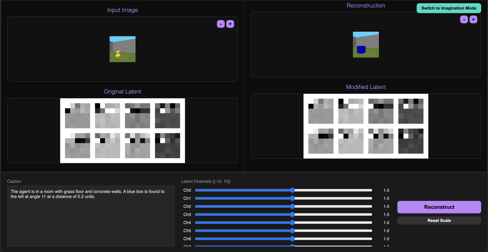
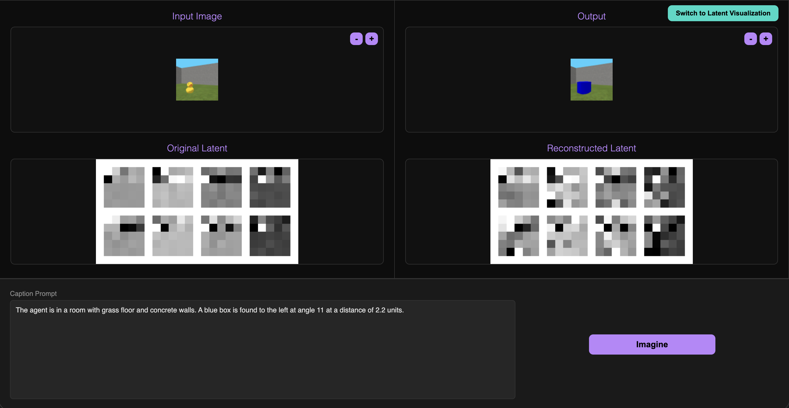

# ASPECT

ASPECT is a framework for training agents to solve target tasks by leveraging knowledge from analogous source tasks. The core idea is to use a text-conditioned VAE to transform observations from a target task into analogous source task observations, allowing an agent trained on the source task to operate in the target environment.

## Workflow

The project follows a three-stage workflow:

1.  **Source Task Training**: An RL agent is trained on a source task. During training, observations and their corresponding textual descriptions are collected.
2.  **VAE Training**: A text-conditioned Variational Autoencoder (VAE) is trained using the collected data (observations and descriptions).
3.  **Target Task Execution**:
    *   The agent encounters a target task.
    *   An LLM transforms the target observation caption into an analogous source observation caption.
    *   The VAE generates a source-like imagined state from the transformed caption.
    *   The source agent policy is executed on the imagined state to solve the target task.

## Installation

Ensure you have Python installed. Install the required dependencies (including PyTorch, Stable Baselines3, Hydra, WandB, Gymnasium, etc.).

```bash
pip install torch torchvision stable-baselines3 hydra-core wandb gymnasium shimmy pyglet accelerate
```

## Usage

### 1. Train Agent (Source Task)

Use `train_agent.py` to train an RL agent. This script also collects data (observations and descriptions) for VAE training.

```bash
python train_agent.py env=MiniWorld agent_name=PPO
```

**Key Arguments:**
*   `env`: The environment to train on (e.g., `MiniWorld`, `PickEnv`). Defined in `config/env`.
*   `agent_name`: The RL algorithm to use (`PPO`, `SAC`, `DQN`).
*   `number_data_to_collect`: Number of samples to collect for VAE training (default: 150000).

### 2. Train VAE

Use `train_vae.py` to train the text-conditioned VAE using the data collected by the agent.

```bash
python train_vae.py env=MiniWorld
```

**Key Arguments:**
*   `env`: The environment corresponding to the collected data.
*   `models`: The VAE model architecture (default: `text_conditioned_vae_cnn`).

### 3. Test Imagination (Target Task)

Use `test_imagination.py` to test the agent on a target task using the trained VAE and an LLM for imagination.

```bash
python test_imagination.py env=MiniWorld agent_name=PPO mode=transfer
```

**Key Arguments:**
*   `env`: The environment (target task configuration).
*   `agent_name`: The agent to load.
*   `mode`: `transfer` for target task (imagination enabled), or `source` for source task.
*   `model_dir`: Path to the trained agent model (e.g., `model_weights/PPO/.../PPO.zip`).
*   `querry_mode`: LLM provider (`openrouter`, `huggingface`, `google`).
*   `llm_model`: The specific LLM model to use.

**Note on Target Task:**
Ensure the environment configuration (e.g., `config/env/MiniWorld.yaml`) reflects the **target task** you want to test. For example, you might need to change the object colors or types in the config to create a scenario different from the source task.

### 4. Configuration

The project uses [Hydra](https://hydra.cc/) for configuration management. All configs are located in the `config/` directory.

*   `config/train_agent.yaml`: Main config for agent training.
*   `config/train_vae.yaml`: Main config for VAE training.
*   `config/test_imagination.yaml`: Main config for testing imagination.
*   `config/env/`: Environment-specific configurations.

You can override any config parameter from the command line:

```bash
python train_agent.py env.total_timestep=500000 agent_name=DQN
```

## Web Interface

The project includes a web application for exploring the VAE latent space and imagination capabilities.

### How to Run

1.  **Install Backend Dependencies**:
    ```bash
    pip install fastapi uvicorn python-multipart hydra-core omegaconf torch torchvision pillow
    ```

2.  **Start Backend**:
    From the project root:
    ```bash
    python3 -m uvicorn test.backend.app:app --host 0.0.0.0 --port 8000
    ```

3.  **Open Frontend**:
    Open `http://localhost:8000/`.

### Features

#### Latent Visualization

In the latent view, the left shows the input image and its corresponding latent, in the right, it shows the readjustable latent (each dimension) and the generated image of the adjusted latent.

#### Imagination Mode

In the imagination mode, it outputs the generation of image using the text and display the latent of the input and the latent of the generated image.

## Results
Below are the episode rollout of the agent with imagination module in different environements and tasks. For MiiWorld and MiniGrid the full view is the top-down view of the environment and the partial view is the first-person view of the agent.
### MiniWorld

| Case 1 | Case 2 | Case 3 |
| :---: | :---: | :---: |
| **Full View**<br><br><br>**Partial View**<br> | **Full View**<br><br><br>**Partial View**<br> | **Full View**<br><br><br>**Partial View**<br> |

### MiniGrid

| Case 1 | Case 2 | Case 3 |
| :---: | :---: | :---: |
| **Full View**<br><br><br>**Partial View**<br> | **Full View**<br><br><br>**Partial View**<br> | **Full View**<br><br><br>**Partial View**<br> |

### PickEnv
In Pick Env, the object fragility are represented by the color of the object, the red object is the least fragile and the green object is the most fragile. A green outer box appears when the object is picked up without breaking and blue box appears if the force applied is weak and red appears if the object is broken.<br>
  

## Project Structure

*   `agent/`: Agent implementations.
*   `architectures/`: Neural network architectures (VAE, etc.).
*   `config/`: Hydra configuration files.
*   `env/`: Custom environments (MiniWorld, PickEnv, etc.).
*   `train_agent.py`: Script for training RL agents and collecting data.
*   `train_vae.py`: Script for training the VAE.
*   `test_imagination.py`: Script for testing agent transfer with imagination.
*   `train_captioner.py`: Script for training the captioner (if applicable).
*   `test/`: Web application code.
